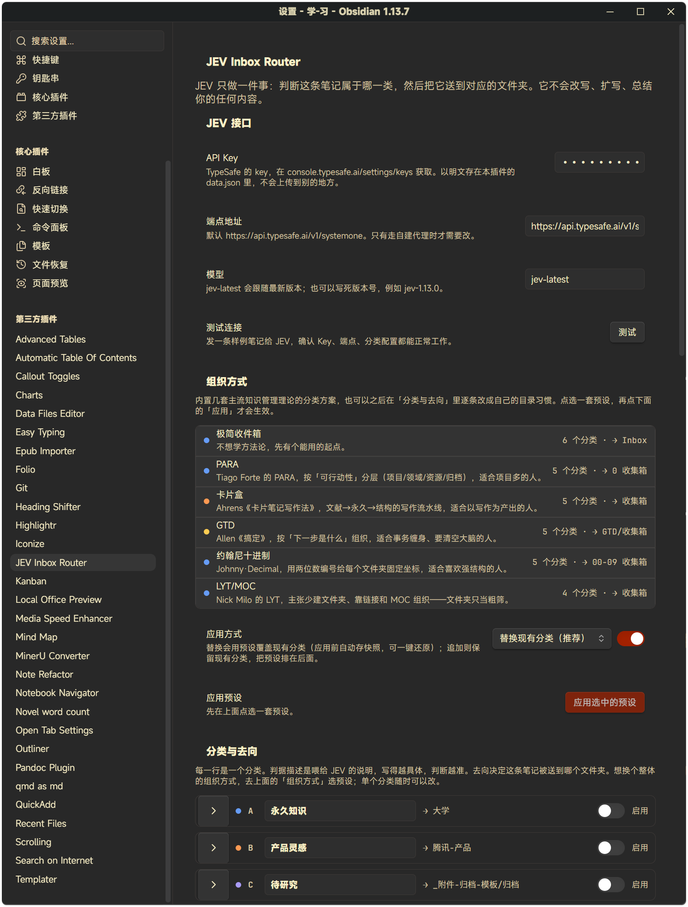

<p align="center">
  
</p>

# JEV Inbox Router

[](https://github.com/liyifan2004/obsidian-jev-inbox-router/releases)
[](LICENSE)
[](https://obsidian.md)

[简体中文](README.md) | English

Uses [JEV](https://typesafe.ai) (TypeSafe's System One model) to decide "which category does this note belong to", then routes it to the matching folder.

**It never writes anything for you.** No summaries, no expansion, no rewriting. It answers exactly one question:

> Where should this go?

## What it does

Everything that lands in Obsidian — quick notes, web clippings, WeChat forwards, PDF excerpts, AI conversations, code snippets, product ideas — first goes to the inbox. The plugin calls JEV and lets it pick one of your (configurable) categories:

| Category | Default destination |
|---|---|
| A Permanent knowledge | `大学` |
| B Product ideas | `腾讯-产品` |
| C To research | `_附件-归档-模板/归档` |
| D To-do | `要做的事` |
| E Reference material | `_附件-归档-模板/附件` |
| F Should be deleted | Mark only, never move |

Category names, criteria descriptions, and target folders are all editable in the settings page to match your own folder structure.

## How results are presented

1. **Status bar**: `待办 48% → 要做的事`. In suggest mode an "Accept" item appears next to it — the file only moves when you click it. Clicking the status bar itself opens the full judgment details.
2. **In-note judgment block**: written at the top (or bottom) of the note, containing the destination, confidence, lead margin, long-term value, the full probability distribution, model, and timestamp. Data only — your own text is never touched.
3. **Frontmatter**: `jev-category` / `jev-confidence` / `jev-model` / `jev-routed-at`, aggregatable with Dataview.

## Safety boundaries

- **Never deletes files.** Notes judged "should be deleted" are only flagged, or moved to a dedicated folder per your settings.
- **Double gate before auto-move.** Both confidence (probability of the chosen option) and lead margin (top ÷ runner-up) must pass, otherwise the note is only flagged.
- Auto-routing is **off by default**. Try it manually a few times first; enable it once you trust the judgments.
- Results are cached by content fingerprint; unchanged content is never re-judged.

## Usage

| Action | Entry |
|---|---|
| Judge the current note and suggest | Command palette: `JEV：判断当前笔记并给出去向建议` |
| Judge the current note and move | Command palette: `JEV：判断当前笔记并直接移动` |
| Accept the last suggestion | Status bar "Accept", or command palette: `JEV：接受上一次建议并移动笔记` |
| Judge without moving | Command palette: `JEV：只判断当前笔记（不移动）` |
| Batch-process the inbox | The inbox icon on the left ribbon, or command palette: `JEV：扫描收件箱并批量处理` |
| Undo the last routing | Command palette: `JEV：撤销上一次分流` |
| Act on a single file | File explorer / editor context menu → JEV commands |

> Commands are currently registered with Chinese names; the UI language follows the model answers. English command names are on the roadmap.

## Configuration

1. Settings → JEV Inbox Router → **JEV API**: paste your TypeSafe API key (`console.typesafe.ai/settings/keys`). Hit "Test" to verify connectivity.
2. **Categories & destinations**: pick a target folder for each category. The more specific the criteria description, the better the judgments.
3. **Auto-routing**: enable it only when you're ready.

### Organization presets

The settings page includes an "Organization" section with 6 built-in category schemes based on mainstream PKM theories: Minimal Inbox (current default), PARA, Zettelkasten, GTD, Johnny Decimal, and LYT/MOC. Pick one and hit "Apply": choose **replace** (existing categories are snapshotted and can be restored in one click) or **append** (keys are auto-remapped on conflict), and optionally pre-create the preset folders; the index folder is set to the preset's suggested inbox. Everything stays editable afterwards under "Categories & destinations".



### Suggest mode (default)

By default, judging **never moves files**: the status bar shows the suggestion with an "Accept" item next to it — clicking it (or running the `JEV：接受上一次建议并移动笔记` command) performs the move. Your explicit click counts as human confirmation and bypasses the double gate — the gate only guards unattended auto-moves. To let the plugin move qualifying judgments automatically, enable "Auto-move after judging" in the auto-routing section; existing users keep their current auto-routing behavior after upgrading.

### Index folder

"Auto-routing → Index folder (where new notes land)" is what JEV watches. It's recommended to also point Obsidian's "Default location for new notes" there (Settings → Files & Links): any note dropped into the index gets judged and receives a suggested destination.

## Installation (developer)

```bash
npm install
npm run verify        # typecheck + unit tests + build, in one command
npm run sync          # copy build artifacts into the default vault's plugins folder
# or target another vault: node scripts/sync-to-vault.mjs "D:\path\to\your\vault"
```

Then enable JEV Inbox Router in Obsidian's Settings → Community plugins.

## Development & testing

| Command | Purpose |
|---|---|
| `npm test` | Unit tests (vitest, 161 cases) |
| `npm run test:watch` | Watch mode |
| `npm run typecheck` | `tsc --noEmit`, covering `src/` and `test/` |
| `npm run build` | esbuild bundle to `main.js` |
| `npm run verify` | All three of the above |

Tests don't need Obsidian itself: `test/mocks/obsidian.ts` is an API stub, and `test/helpers/fake-vault.ts` is an in-memory vault (with `renameFile` and `processFrontMatter` semantics). `vitest.config.mts` maps the `obsidian` import to the stub.

Coverage: judgment rules & double gate (`rules.ts`), judgment block & frontmatter I/O (`note-writer.ts`), JEV request building & error retry (`jev-client.ts`), the full routing flow / cache / undo / name conflicts (`router.ts`), settings migration (`settings-normalize.ts`). `main.ts` is pure wiring (command registration, status bar, event subscriptions) and is not unit-tested.

## Companion tools

- `scripts/sync-to-vault.mjs` — sync build artifacts into an Obsidian vault
- `scripts/gh-push.ps1` — push the current branch to GitHub in one command, optionally creating a private repo
- `docs/github-push-from-agent.md` — why `git push` silently fails in non-interactive environments, and how to work around it

## About JEV

JEV doesn't generate text; it returns typed answers with probabilities (`choice` / `score` / `noul`). The plugin uses `choice`: the six categories as candidates, with the full probability distribution in one request.

- Endpoint: `POST https://api.typesafe.ai/v1/systemone`
- Model: `jev-latest`
- Pricing: input $0.042 / M tokens, output free

## Known limitations

- Undo history keeps only the last 10 operations, stored in `data.json`; notes longer than 20k characters only get their location rolled back, not their content.
- Each judgment sends the note body (up to 6000 characters) plus your own frontmatter to TypeSafe. **The judgment block and `jev-*` fields written by the plugin are never sent** — otherwise the next judgment would be biased by the previous conclusion. If that bothers you, keep auto-routing off.
- The cache fingerprint **only covers the note body**, not frontmatter. Changing only frontmatter (tags, aliases, etc.) won't trigger a re-judgment.
- Raw probabilities of a six-way single choice are naturally low (0.3–0.6 is normal); don't compare them directly with binary-classifier confidence. The plugin uses "probability of the chosen option" and "top ÷ runner-up", not the model's self-reported `confidence`.

## License

[MIT](LICENSE)
